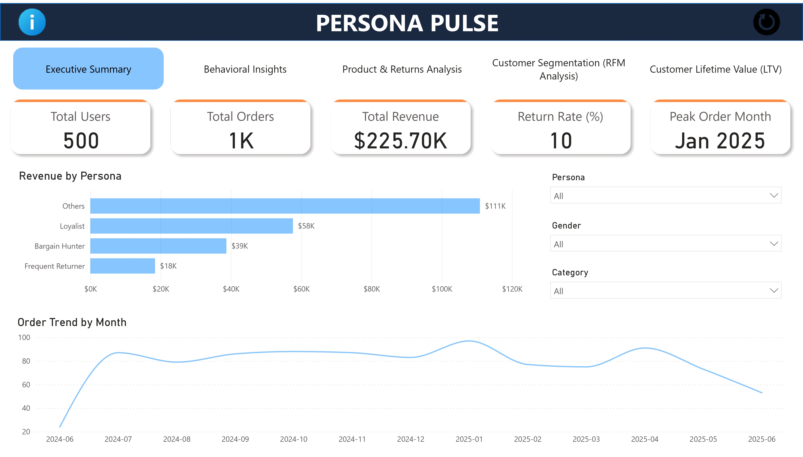
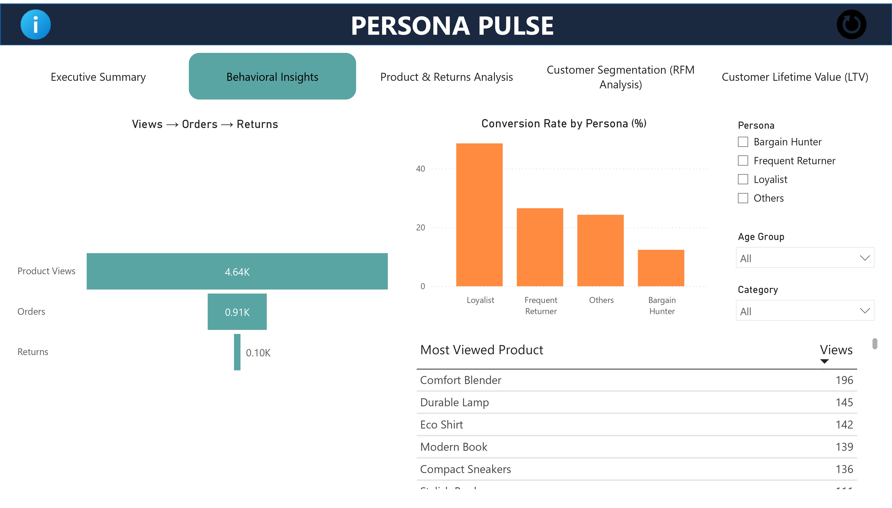
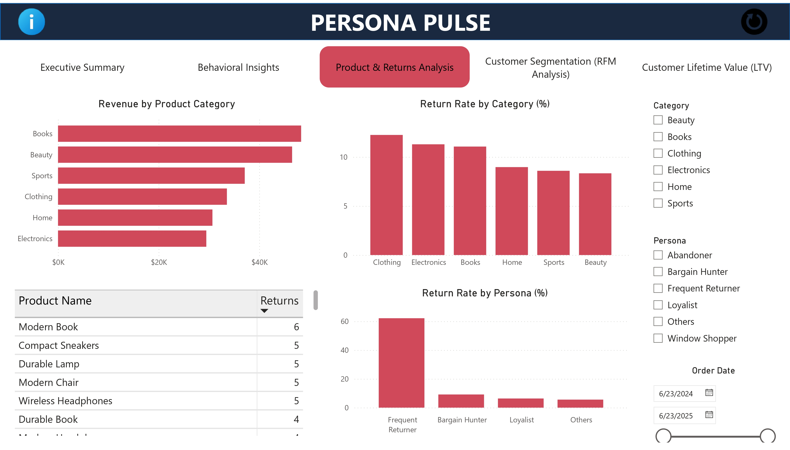
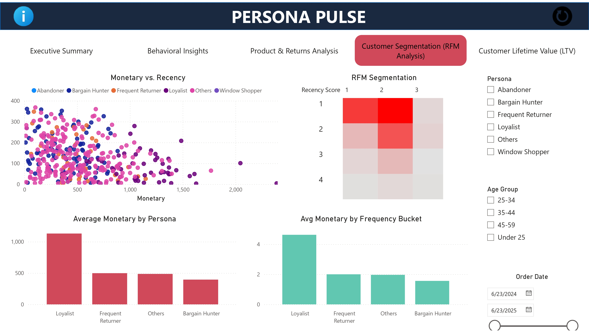

# 🧠 PersonaPulse – Predictive Persona Strategy for E-Commerce

**PersonaPulse** is a full-stack data analytics and machine learning project designed to help e-commerce businesses understand customer behavior, identify high-value personas, and predict buyer intent. It combines SQL-based analysis, Power BI dashboards, and a buyer intent prediction model to deliver actionable business insights.

---

## 🚀 Project Overview

PersonaPulse analyzes how customer personas influence buying behavior using:

- 🔍 **SQL**: RFM segmentation, Lifetime Value (LTV), and funnel drop-off analysis  
- 📊 **Power BI**: 5-page dashboard for KPIs, drop-offs, segmentation, and buyer insights  
- 🤖 **Python ML Model**: Random Forest classifier to predict purchase intent (89% accuracy)  

The goal is to improve marketing targeting, reduce returns, and drive smarter decisions through end-to-end data solutions.

---

## 📂 Tech Stack

- **Database**: PostgreSQL  
- **Visualization**: Power BI  
- **Analytics**: SQL, DAX, Excel  
- **Programming & ML**: Python, Pandas, Scikit-learn, Joblib, Matplotlib  
- **Model**: Random Forest Classifier  

---

## 📊 Dashboard Pages

1. **Overview & KPIs** – Total revenue, orders, AOV  
2. **Funnel Drop-Off Analysis** – Where users exit the journey  
3. **Persona Segmentation (RFM)** – Grouped by Recency, Frequency, Monetary value  
4. **Lifetime Value (LTV)** – Customer value over time by persona  
5. **Buyer Intent Prediction** – ML output integrated with personas

**Executive Summary** 

**Behavioral Insights** 

**Product & Return Analysis** 

**Customer Segmentation (RFM)** 

**Customer Lifetime Value** 

---

## 🔎 Key Insights

- 🟢 **Loyal Minimalists** had the highest LTV but were under-targeted.  
- 🔴 **Impulsive Buyers** showed high return rates and low average revenue.  
- 📉 23% of users dropped off post product view — highest among price-conscious personas.  
- ✅ ML model achieved **89% accuracy** in predicting purchase intent.

---

## 💡 Lessons Learned

- Designed full ETL pipelines using PostgreSQL for production-style analysis  
- Applied RFM & LTV models to generate actionable business segments  
- Built classification models and learned how to align predictions with business goals  
- Integrated dashboards and machine learning into a cohesive analytics strategy  
- Practiced clear data storytelling through visuals and strategic recommendations

---

## 📁 Repo Contents

- `Notebook` – ML model training and evaluation  
- `SQL` – All SQL queries: RFM, LTV, funnel analysis  
- `Model` – Trained model for reuse  
- `Data` – All Dateset  

---

## 🔗 Links

- 📊 [Dashboard Demo](https://app.powerbi.com/view?r=eyJrIjoiNDE3MmJhY2YtYjY0OS00YjQyLTkwMTUtNmI2OGU5NWYyZGMwIiwidCI6ImI0MWQ5MTc5LWUzN2EtNDY0Zi04Yjg2LThhMmUwYjUxODUyOSJ9)  
- 🌐 [Portfolio Site](https://insightsbyme.framer.ai/)  

---

## 📬 Author

Vishal Gupta
[📫 LinkedIn](https://www.linkedin.com/in/itsvishal08/)
[📧 Gmail](mailto:itzmevishal08@gmail.com)

---

> “This project bridges data science and business — helping companies target the right users, reduce return rates, and grow smarter.”
